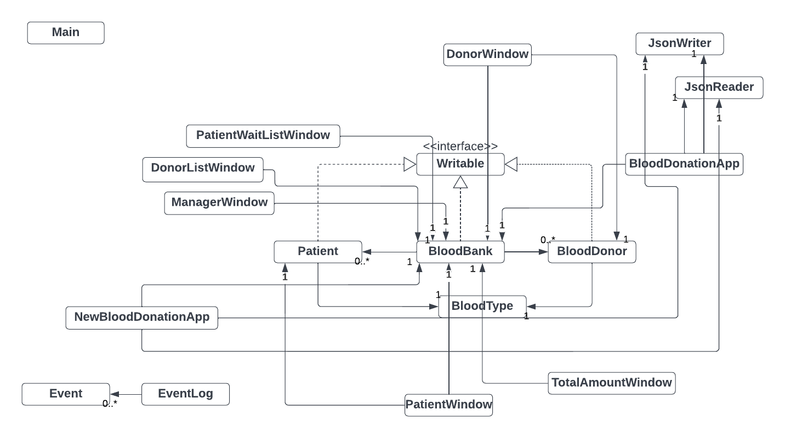
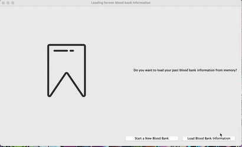

# :syringe: Blood Donation System 

### :busts_in_silhouette: Three Characters:
- Blood Bank Manager :bowtie:
- Blood Donor :muscle:
- Patient :mask:

### :memo: Description
This project is a smart *blood donation* :syringe: management system. It is designed for the blood service providers
, aiming to manage the information of blood donors, manage the blood in the inventory, and distribute blood to patients 
in need systematically.

The project is based on **java** language. It is only available on **desktops** :computer:. 

 

### :sparkles: Inspiration 
I've been a Red Cross volunteer for 3 years in China, and I am a blood donor. Blood can save lives, and I hope to design 
a software to make the donation process more efficient. 

### :ocean: User Stories 
- Users can choose a character from **blood bank manager:bowtie:**, **blood donor:muscle:**, and **patient :mask:**.
 
- Donors will be checked whether they are **eligible (age>=17 & weight>=50)**.  
 
- Donors' blood will be added to **blood bank** :bank: and their info will be **stored** at a **donor list** :page_with_curl:.
 
- Blood is **distributed** patients according to their **blood type**:
  - Patient with Type :a: blood can receive Type :a: or :o2: blood. 
  - Patient with Type :b: blood can receive Type :b: or :o2: blood.
  - Patient with Type :ab: blood can receive Type :ab:, :a:, :b: or :o2: blood.
  - Patient with Type :o2: blood can only receive Type :o2: blood.
    - **WE NEED MORE TYPE O DONORS!!!!!!!!!!!!!!! :hushed:**
 
- When there's no sufficient blood, the patient will be added to the **wait list** :page_with_curl:with their names, blood types, and required amounts on it. 
 
- The **manager** can access the **overall** information of the **blood bank**:
  - Total amount of :a:
  - Total amount of :b:
  - Total amount of :ab:
  - Total amount of :o2:
  - Donor list :memo:
  - Normal patient wait list :page_with_curl:
  - Urgent patient wait list :notebook:
- When the users select the quit option from the main menu, they can be reminded to save the bloodbank information(total amount of blood, donor list, patient wait list) to file and have the option to do so or not.
 
- When the users start the application, they will be given the option to resume exactly where they left off last time.
 
